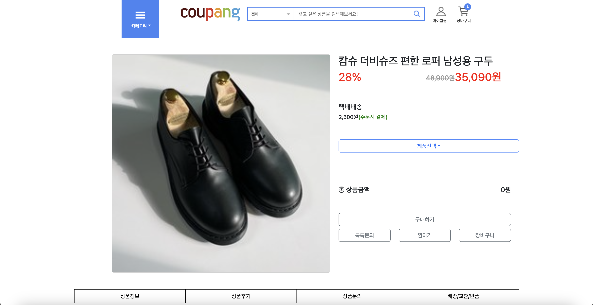
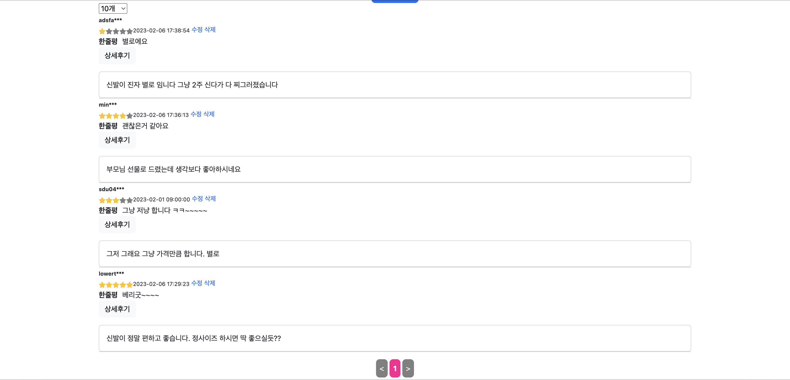
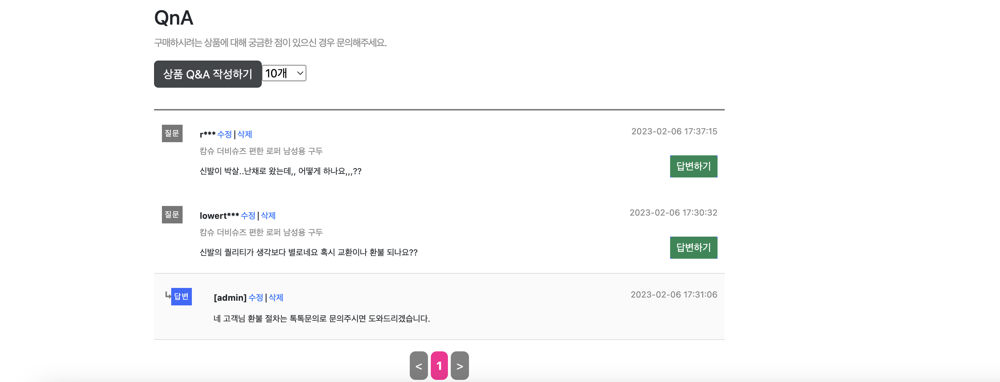
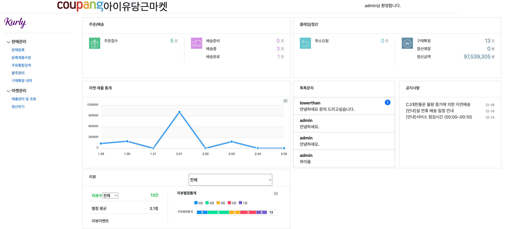

<h1 align="center">
  
    쿠팡 클론코딩
</h1>

## 소스코드
- 백엔드 : [백엔드](https://github.com/Donipop/green-shopping)
- 프론트 : [프론트](https://github.com/Donipop/green-shoppingf)
- Notion : [노션](https://jazzy-mastodon-86d.notion.site/8755e4495db44243aed1ecbc51fb345f)
- Cavans : [캔버스](https://www.canva.com/design/DAFYzAIfsbw/X3UiN3__E9kqZWMeAbe9MA/view?utm_content=DAFYzAIfsbw&utm_campaign=designshare&utm_medium=link2&utm_source=sharebutton#2)

 
 

# 목차
- [개발배경](#개발배경)
- [참고사항](#기존-사이트-참고)
- [사용된 기술](#사용된-기술)
- [서비스 흐름도](#서비스-흐름도)
- [사이트맵](#사이트맵)
- [ERD](#erd)
- [예시화면](#예시화면)

 

# 개발배경
프로젝트의 진행하는데 있어 테마를 먼저 정했어야 했는데 요구조건은 다음과 같았다.

- 가능한 한 **많은 기능을 구현**해볼수 있을 것
- 참신한 아이디어가 아닌 본인이 **많이 써본 테마일** 것
- **React**를 배우면서 사용하기 때문에 참고자료가 많은 테마일 것

커뮤니티와 이커머스 2가지 선택지가 떠올랐고 이 중 레퍼런스가 많고 서버 사이드의 많은 기능을 직접 구현해 볼 수있는 **이커머스를** 테마로 결정하였고 쇼핑몰 프로젝트(쿠팡 클론)을 시작하게 되었다.

 
 

# 기존 사이트 참고

네이버 쇼핑, 쿠팡은 우리나라 대표적인 이커머스 플랫폼이다.

- 쿠팡
    - 소비자입장에서 익숙한 기능이 잘 적용되어있는 점 참고
        - 소비자 입장에서의 기능을 참고했다.
            1. 상품들에 대한 카테고리(번호) 시스템
            2. 메인화면에서 유저에 대한 아이템 추천 시스템
            3. 주문목록조회, 개인정보 수정 및 확인, 쿠폰 리스트, 나의 리뷰
            4. 판매자 회원 등록기능
- 네이버
    - 판매자를 위한 판매자 센터가 잘 적용되어 있는  점 참고
        - 판매자 입장에서의 기능을 참고했다.
            1. 제품등록, 제품수정, 주문통합검색, 발주관리, 구매확정 내역 확인, 톡톡문의 기능
            2. 매출관리 및 조회, 정산 신청 기능
            3. 판매자 메인페이지에서 전체적인 통계 기능

 
 

# 사용된 기술

# 서비스 흐름도

# 사이트맵

# ERD

# 예시화면
### 메인페이지

### 뷰페이지

### 셀러센터

 
 

# 후기

## 좋았던점

### 배민재

- 처음으로 리액트를 활용한 프로젝트를 진행했던 점
    - 리액트를 처음 사용하기 때문에 프로젝트를 진행하면서 동시에 리액트를 배우며 사용 해야 했기에 기능 구현에 어려움도 있었지만 그 덕분에 더 성장할 수 있는 계기가 된거같아 좋았다
- Git에 조금 더 가까워진 거 같아 좋았습니다
    - 진행했던 프로젝트 중 가장 파일 개수가 많았고 그로 인해서 충돌도 많이 생겼는데 충돌을 해결해 가며 Git 충돌에 대해 조금 더 가까워져서 좋았다.

### 오우성

- **재사용성을 높힌 작은 단위의 컴포넌트 개발**
    - 프론트엔드에서 리액트 컴포넌트 단위로 개발을 하여 재사용성을 높이니 개발이 편했다. 작은 단위 컴포넌트로 개발하면 어떤 점이 편한지 느낄 수 있었다. 예를 들어 기존에 클론 코딩을 진행하거나 혼자 토이프로젝트를 한다고 쳤으면 아마 페이지 단위로 작업하면서 거기서 필요한 작은 단위의 엘리먼트(버튼, 인풋, 라벨 등등)들이 필요했다면 그때그때마다 만들면서 개발을 했을 것이다. 하지만, 이번에는 프로젝트 시작전부터 컴포넌트를 최대한 재사용해보는 쪽으로 목표를 두고 서비스 전체에서 쓰일 공통 컴포넌트와 기능들을 미리 생각해서 개발해보기로 했다.  그러하여 페이지마다 당연하게 쓰일 수 밖에 없는 엘리먼트들을 미리 다 만들어두고 하니 페이지에서는 `import`로 그때그때 가져와서 쓰면 됐다.
- **협업**
    - 
    
    개발적으로도 많은 스택과 경험을 얻어갔고, 프론트에서 여러가지 스택을 써본 것, 백엔드 인프라 구성 등등등... 근데 가장 얻은 것중 귀중하다 생각한 건 좋은 사람들과 프로젝트 하는게 얼마나 즐거운지다. 정말 "몰입"이라는 것을 한 것 같다. 일이 끝나고 피곤하더라도 좀 더 좋게 구현하고 싶어서 공부를 더 한다던지 조사한다던지 지금 생각하면 어떻게 했는지 신기하다. 또, 사람에 대한 관계 또한 조금 더 성숙해졌다. 프로젝트를 하다보면 서로 의견 충돌이나 오해가 생길 수 밖에 없다 생각하는데 이런 부분에 대해 좀 더 유연한 사고를 할 수 있게 되었다.
    

### 장진성

1. 첫번째 프로젝트에서는 테이블을 4개만 사용하고 Java Script를 사용하였으나
    
    이번 프로젝트는 테이블이 20개가 넘고 유기적으로 서로 연결되어 있어 설계를 어떻게 해야하는지 
    
    알아보는점이 좋았다.
    
2. 그리고 React를 처음 사용해봤는데 어떻게 사용해야하는지 알아보는 과정도 재밌었다.
3. 처음으로 3개월이 넘는동안 프로젝트를 진행했는데 의견취합, 토론의 과정 그리고 파트 별로 나눠서 
    
    만들어가는 과정, 그리고 최종적으로 병합해서 만들어진것을 보면 정말 아름다운 직업인거 같다.
    

## 아쉬웠던점

### 배민재

- 기초가 탄탄하지 못한것(컬럼명, 테이블명등 일관되게 작성하지 못한 부분)
    - 이번 프로적트에서 본다면 Product_Tb Id컬럼이 있는데 이것을 참조하는 다른 테이블의 컬럼명이 어떤곳은 Product_Num 어떤곳은 ProductId로 되어있어 통일성이 있지 못하고 보기에도 햇갈릴 수 있기 때문에 처음부터 이름, 타입 등을 정해놓고 했으면 더 좋았을거 같았다.
- 초기 DB설계 단계에서 조금 더 신중하게 생각했다면 어땠을까 하는 점
    - 이번 프로젝트로 예를 본다면 79번의 ID를 가진 제품에 대한 이미지를 가져오는 방식은
            Product_Img_Tb에서 Product_Num컬럼에 79인 것에 대한 File_Name컬럼을 가져와
            File_Tb에서 Name 컬럼을 참조해 같은 File_Tb에 있는 File_Type컬럼에 있는 확장자를 붙여야 비로소 이미지.png (fileName.fileType)의 형식을 가져올 수 있게 되어있기에 이것을 좀 더 간소화 하거나 Product_Img_Tb에 확장자까지 같이 넣어놨으면 더 괜찮은 DB가 되었을 거라 생각한다.

### 오우성

프로젝트를 시작하기 전에 테스트, 주석, 문서화 등 기본기가 중요하다는 글을 몇 번 본적이 있었지만 크게 피부로 와닿지 않았다. 그 결과 프로젝트를 진행하면서 이러한 기본기들을 작성하지 않은채 기능 구현 위주로 프로젝트를 진행했다. 그러다보니 기능이 점점 추가되고 코드의 양이 쌓이다보니 왜 그렇게 다른 사람들이 기본기의 중요성에 대해 말하는지 알 수 있었다.  내가 직접 짠 코드지만 왜 이렇게 사용하였고 짰는지 단번에 알기 어려웠고 일관되게 작성하지 않은 코드들은 더욱 더 알아보기 힘들었다. 

### 장진성 -

1. React를 배우는데 걸린 시간과 익숙지 않은 것에 대한 실수로 인해 벌어진 버그를 수정하는데 걸린 시간들이 너무 많았다.
2. 로그인 시스템을 구현하는 입장에서 다시 되돌아보니 너무 아쉬웠다. 비록 로그인, 보안에 대해서 공부를 못했다는 점이 있지만 이것은 변명 일 뿐 결론적으로 세션과 토큰의 단점 들만 모아서 만들어진 결과물 이었다.
3. 로그인 구현 과정에 시간을 너무 낭비해서 우리 팀원 들의 작업물에 비하면 상대적으로 적은 결과물이 나왔다. 시간분배에 실패했다.
4. 진행중인 프로젝트에 사용된 기술들을 제대로 이해하지 못하고 작업했다. Rest api, Spring Boot, React 등등
5. 처음에 데이터베이스 설계할때 완벽하게 하지 못해서 나중에 테이블을 수정해 
    
    시간이 질질 끌리는 일이 있었다.
    

## 보완해야 될 점

1.살아있는 문서를 만들자

이번 팀 프로젝트를 하면서 살아있는 문서를 만드는 것이 얼마나 중요한 것인지 알게 되었다. 사람인지라 한 번 나누었던 이야기, 들었던 이야기를 모두 기억할 순 없다. 시간이 지나면 생각하고 싶은 대로 생각하게 되고 편하게 기억하고 싶은대로 기억하기 때문에 왜곡이 발생하고, 그로 인해 개발에 문제가 생기게 된다.

기억이 나지 않으면 다시 물어보고 진행하면 되지만, 이게 매번 반복되면 얼마나 민폐스럽고 비효율적인가. 다행히도 회의한 내용들을 노션에 정리하면서 진행했기 때문에 이런 문제가 많지 않았다.

다만 조금 아쉬웠던 것은 "이런 불편함이 있다.", "쳬계적으로 문서화하면 좋겠다."는 생각을 갖고만 있고 실행을 하지 않은 게 많이 아쉽다. API를 사용하면서 이런 사항을 조심하면 좋을 것 같다. 데이터 가공은 이렇게 통일해달라, 로직은 어떻게 통일하면 좋겠다 등 여러 얘기를 많이 나누었는데 문서가 있음에도 불구하고 그때그때 구두로 상의하고 적용하다 보니 해당 내용을 까먹기 십상이었다. 팀 노션 페이지에 이런 내용을 구분해서(API 관련 내용, 데이터 처리 내용처럼 분류를 해서) 작성을 했으면 개인적으로 문서화하는 능력도 생기고 팀원들도 많은 도움이 되지 않았을까 싶다.

1. 코드리뷰

Github을 이용했지만 제대로 된 코드리뷰를 진행한적이 없다. 프로젝트 완성이 급했기 때문에 코드 리뷰가 부족했던 것 같다. 각자의 브랜치에서 작업한 것을 main브랜치에 merge 하는것에만 급급하여 merge하는 과정에서의 리뷰는 자연스럽게 사라지게 되었다.

 프로젝트 초기 계획 당시 완벽한 리뷰 시스템은 아니더라도 어느 정도의 리뷰 후 merge를 하자는 의견이었는데, 아무래도 기능 구현에만 신경을 쓰다보니 논의(혹은 내용 전달) 후 merge를 하는 방향으로 프로젝트를 진행하게 되었다. 덕분에 빠른 속도로 개발을 진행할 수 있었지만(리뷰에 시간을 아꼈기 때문) 이로 인해 추후에 특정 코드 부분에서 궁금한 사항이 생기기도 하고, 별도의 설명이 필요하여 시간을 소모하게 되는 순간도 종종 생겼다. 코드 리뷰는 반드시 해야하는 것 이라는 것을 느끼게 해준 프로젝트 였다.

1. React

React는 모두 처음 접해본 내용이였다. React로 간단한 강의 영상만 보고 바로 프로젝트를 진행하게 되었는데 여태 해왔던 것이 내용들이 있어 못 따라갈정도로 어렵고 헤맨것은 아니지만 React에 대한 이해도가 많이 없는 상태로 프로젝트를 진행하다 보니 어려움이 있었다. 특히나 Hook에 대해서 많이 어려움이 있었다. 

어떻게 사용해야 Hook을 적절하게 사용하는지 많이 어려웠던 것 같다. 강의를 듣고 React Docs를 통해 공부를  하였을 때 "Hook 사용을 최대한 줄이고 시작해보라"라는 내용이 생각났다. 그 말을 처음 들었을 땐, "그냥 함수나 변수에 알맞은 Hook을 가져다 사용하면 되지 않나" 싶었다. 실제로 개발을 해보니 Hook deps 하나에 따라 렌더링 조건이 완전히 달라지고 원하는 결과가 나오지 않는 것을 보면서 왜 그렇게 말하였는지 알게 되었다

아직 Hook에 대해 정확하게 이해하고 있지 않기 때문에 어설프게 사용하면 사용하지 않느니만 못할 수 있다고 생각된다. 프로젝트를 시작하기 전에 대략적으로 Hook에 대해 정리를 했었는데 Hook에 대한 정확한 이해가 많이 필요하다고 느껴졌다.

  4. 데이터베이스

데이터베이스에 관해서는 정말 다산다난 했다. 처음엔 그냥 생각나는대로, 경우의 수를 생각하지 않고
설계를 하였으나 나중에 프로젝트 중반쯤에 이 테이블이 필요하겠다 아니면 다른 테이블을 수정을 해서 또 다른
테이블의 데이터들도 다 수정해야 하는 등 이미 초반에 끝냈어야 하는 일들이 추가적으로 발생 해
프로젝트 일정에 차질이 생길 정도였다.
데이터베이스에서 제일 중요한 데이터 무결성은 데이터의 정확성, 일관성, 유효성이 유지되어야 하는것인데 

이러한 것에 정확한, 완벽한 설계를 하지 않으면
중복된 데이터가 존재하거나 논리적 관계가 깨져 잦은 에러와 재설계를 해야하는 번거로움이 생길 수 있다는것을
다시한번 배우게 되었다.

