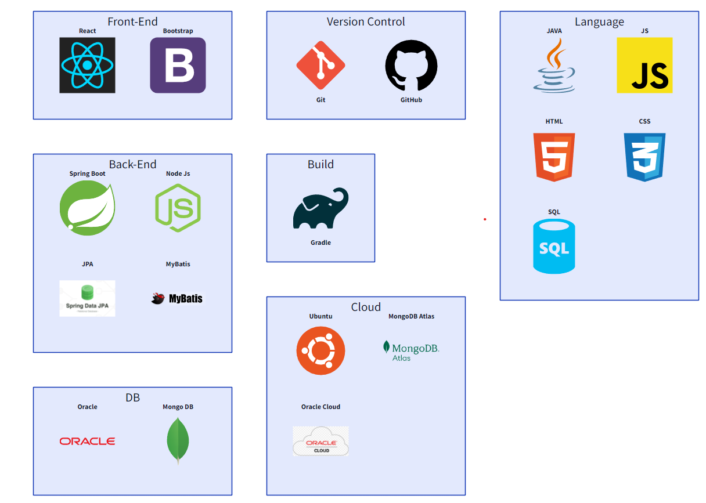
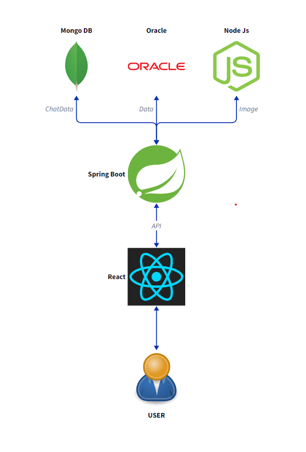
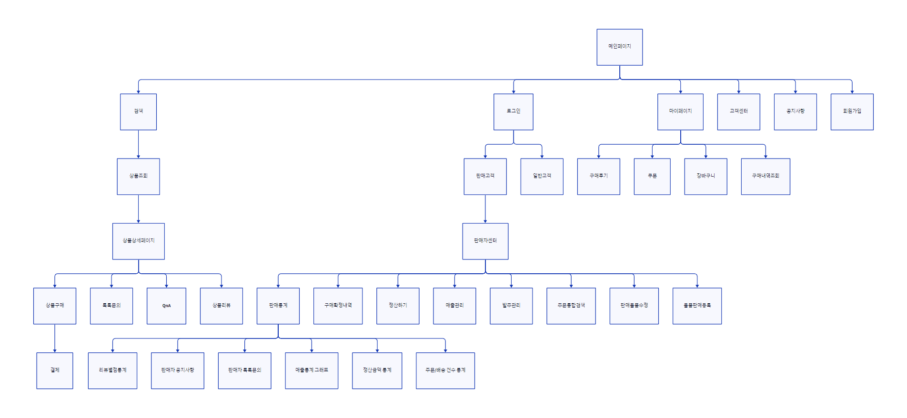
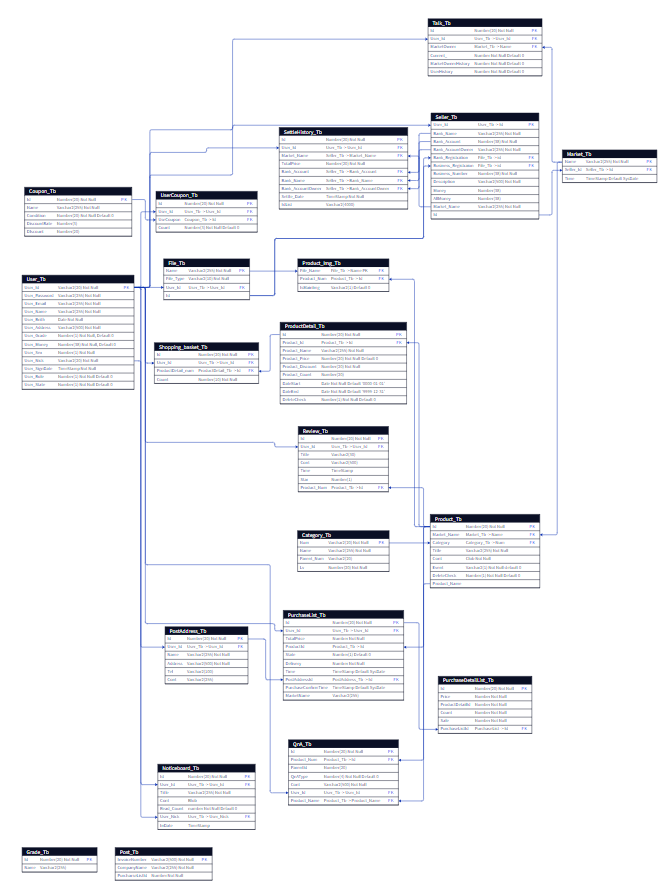

<h1 align="center">
  
    쿠팡 클론코딩
</h1>

## 소스코드
- 백엔드 : [https://github.com/Donipop/green-shopping](https://github.com/Donipop/green-shopping)
- 프론트 : [https://github.com/Donipop/green-shoppingf](https://github.com/Donipop/green-shoppingf)

 
 

# 목차
- [개발배경](#개발배경)
- [참고사항](#기존-사이트-참고)
- [사용된 기술](#사용된-기술)
- [서비스 흐름도](#서비스-흐름도)
- [사이트맵](#사이트맵)
- [ERD](#erd)
- [예시화면](#예시화면)

 

# 개발배경
프로젝트의 진행하는데 있어 테마를 먼저 정했어야 했는데 요구조건은 다음과 같았다.

- 가능한 한 **많은 기능을 구현**해볼수 있을 것
- 참신한 아이디어가 아닌 본인이 **많이 써본 테마일** 것
- **React**를 배우면서 사용하기 때문에 참고자료가 많은 테마일 것

커뮤니티와 이커머스 2가지 선택지가 떠올랐고 이 중 레퍼런스가 많고 서버 사이드의 많은 기능을 직접 구현해 볼 수있는 **이커머스를** 테마로 결정하였고 쇼핑몰 프로젝트(쿠팡 클론)을 시작하게 되었다.

 
 

# 기존 사이트 참고

네이버 쇼핑, 쿠팡은 우리나라 대표적인 이커머스 플랫폼이다.

- 쿠팡
    - 소비자입장에서 익숙한 기능이 잘 적용되어있는 점 참고
        - 소비자 입장에서의 기능을 참고했다.
            1. 상품들에 대한 카테고리(번호) 시스템
            2. 메인화면에서 유저에 대한 아이템 추천 시스템
            3. 주문목록조회, 개인정보 수정 및 확인, 쿠폰 리스트, 나의 리뷰
            4. 판매자 회원 등록기능
- 네이버
    - 판매자를 위한 판매자 센터가 잘 적용되어 있는  점 참고
        - 판매자 입장에서의 기능을 참고했다.
            1. 제품등록, 제품수정, 주문통합검색, 발주관리, 구매확정 내역 확인, 톡톡문의 기능
            2. 매출관리 및 조회, 정산 신청 기능
            3. 판매자 메인페이지에서 전체적인 통계 기능

 
 

# 사용된 기술

# 서비스 흐름도

# 사이트맵

# ERD

# 예시화면
### 메인페이지

### 뷰페이지

### 셀러센터

 
 

# 후기

## 좋았던점
### 배민재
- 처음으로 리액트를 활용한 프로젝트를 진행했던 점
    - 리액트를 처음 사용하기 때문에 프로젝트를 진행하면서 동시에 리액트를 배우며 사용 해야 했기에 기능 구현에 어려움도 있었지만 그 덕분에 더 성장할 수 있는 계기가 된거같아 좋았습니다
- Git에 조금더 가까워 진거같아 좋았습니다
    - 진행했던 프로젝트중 가장 파일 개수가 많았고 그로 인해서 충돌도 많이생겼는데 충돌을 해결해가며 조금더 Git에 가까워 졌다 생각합니다.
## 아쉬웠던점
### 배민재
- 기초가 탄탄하지 못한것
    - 컬럼명, 테이블명등 일관되게 작성하지 못한 부분
        - 이번 프로적트에서 본다면 Product_Tb Id컬럼이 있는데 이것을 참조하는 다른 테이블의 컬럼명이 어떤곳은 Product_Num 어떤곳은 ProductId로 되어있어 통일성이 있지 못하고 보기에도 햇갈릴 수 있기 때문에 처음부터 
    - 초기 DB설계 단계에서 조금 더 신중하게 생각했다면 어땠을까 하는 점
        - 이번 프로젝트로 예를 본다면 79번의 ID를 가진 제품에 대한 이미지를 가져오는 방식은
        Product_Img_Tb에서 Product_Num컬럼에 79인 것에 대한 File_Name컬럼을 가져와
        File_Tb에서 Name 컬럼을 참조해 같은 File_Tb에 있는 File_Type컬럼에 있는 확장자를 붙여야 비로소 이미지.png`(fileName.fileType)`의 형식을 가져올 수 있게 되어있기에 이것을 좀 더 간소화 하거나 Product_Img_Tb에 확장자까지 같이 넣어놨으면 더 괜찮은 DB가 되었을 거라 생각합니다.

